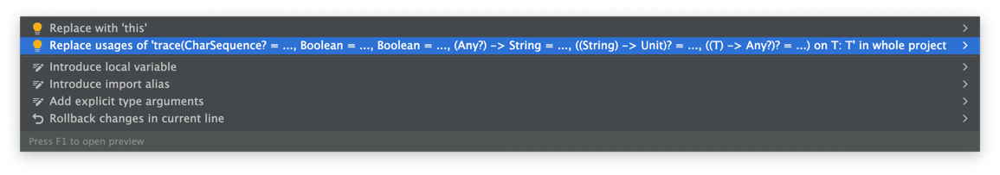
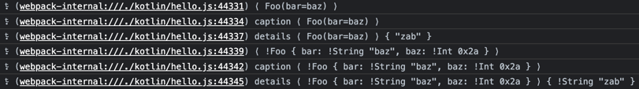
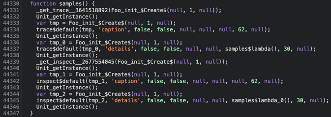

# Kommons [![Download from Maven Central](https://img.shields.io/maven-central/v/com.bkahlert.kommons/kommons-debug?color=FFD726&label=Maven%20Central&logo=data%3Aimage%2Fsvg%2Bxml%3Bbase64%2CPD94bWwgdmVyc2lvbj0iMS4wIiBlbmNvZGluZz0idXRmLTgiPz4KPCEtLSBHZW5lcmF0b3I6IEFkb2JlIElsbHVzdHJhdG9yIDI1LjEuMCwgU1ZHIEV4cG9ydCBQbHVnLUluIC4gU1ZHIFZlcnNpb246IDYuMDAgQnVpbGQgMCkgIC0tPgo8c3ZnIHZlcnNpb249IjEuMSIgaWQ9IkxheWVyXzEiIHhtbG5zPSJodHRwOi8vd3d3LnczLm9yZy8yMDAwL3N2ZyIgeG1sbnM6eGxpbms9Imh0dHA6Ly93d3cudzMub3JnLzE5OTkveGxpbmsiIHg9IjBweCIgeT0iMHB4IgoJIHZpZXdCb3g9IjAgMCA1MTIgNTEyIiBzdHlsZT0iZW5hYmxlLWJhY2tncm91bmQ6bmV3IDAgMCA1MTIgNTEyOyIgeG1sOnNwYWNlPSJwcmVzZXJ2ZSI%2BCjxnPgoJPGRlZnM%2BCgkJPHBhdGggaWQ9IlNWR0lEXzFfIiBkPSJNMTAxLjcsMzQ1LjJWMTY3TDI1Niw3Ny45TDQxMC40LDE2N3YxNzguMkwyNTYsNDM0LjNMMTAxLjcsMzQ1LjJ6IE0yNTYsNkwzOS42LDEzMS4ydjI0OS45TDI1Niw1MDYKCQkJbDIxNi40LTEyNC45VjEzMS4yTDI1Niw2eiIvPgoJPC9kZWZzPgoJPHVzZSB4bGluazpocmVmPSIjU1ZHSURfMV8iICBzdHlsZT0ib3ZlcmZsb3c6dmlzaWJsZTtmaWxsOiNGRkZGRkY7Ii8%2BCgk8Y2xpcFBhdGggaWQ9IlNWR0lEXzJfIj4KCQk8dXNlIHhsaW5rOmhyZWY9IiNTVkdJRF8xXyIgIHN0eWxlPSJvdmVyZmxvdzp2aXNpYmxlOyIvPgoJPC9jbGlwUGF0aD4KPC9nPgo8L3N2Zz4K)](https://search.maven.org/search?q=g:com.bkahlert.kommons%20AND%20a:kommons-debug) [](https://github.com/bkahlert/kommons-debug/releases/latest) <!--[](https://bintray.com/bkahlert/koodies/koodies/_latestVersion)--> [](https://github.com/bkahlert/kommons-debug/actions/workflows/build.yml) [](https://github.com/bkahlert/kommons-debug) [](https://github.com/bkahlert/kommons-debug/blob/master/LICENSE)

<!-- C21E73 -->

## About

**Kommons** is a Kotlin Multiplatform Library to support print debugging.


## Installation / Setup

Kommons Debug is hosted on GitHub with releases provided on Maven Central.

* **Gradle** `implementation("com.bkahlert.kommons:kommons-debug:0.3.0")`

* **Maven**
  ```xml
  <dependency>
      <groupId>com.bkahlert.kommons</groupId>
      <artifactId>kommons-debug</artifactId>
      <version>0.3.0</version>
  </dependency>
  ```

## Features

### Any?.trace / Any?.inspect

Print tracing information and easily cleanup afterwards using
IntelliJ's code cleanup

#### Example

```kotlin
data class Foo(val bar: String = "baz") {
    private val baz = 42.0
}

Foo().trace
// output: (sample.kt:5) ⟨ Foo(bar=baz) ⟩

Foo().trace("caption")
// output: (sample.kt:8) caption ⟨ Foo(bar=baz) ⟩

Foo().trace("details") { it.bar.reversed() }
// output: (sample.kt:11) details ⟨ Foo(bar=baz) ⟩ { "zab" }

Foo().inspect
// output: (sample.kt:14) ⟨ !Foo { baz: !Double 42.0, bar: !String "baz" } ⟩

Foo().inspect("caption")
// output: (sample.kt:17) caption ⟨ !Foo { baz: !Double 42.0, bar: !String "baz" } ⟩

Foo().inspect("details") { it.bar.reversed() }
// output: (sample.kt:20) details ⟨ !Foo { baz: !Double 42.0, bar: !String "baz" } ⟩ { !String "zab" }
```



The example above also work in browsers:





### Any.renderType()

Renders any object's type

#### Examples

```kotlin
"string".renderType()               // String

class Foo(val bar: Any = "baz")
foo().renderType()                  // Foo

val lambda: (String) -> Unit = {}
lambda.renderType()                 // (String)->Unit
```

### Any?.render()

Renders any object depending on whether its `toString()` is overridden:

- If there is a custom `toString()` it is simply used.
- if there is *no custom* `toString()` the object is serialized in the form structurally

#### Examples

```kotlin
"string".render()               // string

class Foo(val bar: Any = "baz")
foo().render()                  // { bar: "baz" }
foo(foo()).render(typed = true)   // Foo { bar: Foo { bar: "baz" } }
```

### Any.properties

Contains a map of the object's properties with each entry representing
the name and value of a property.

#### Examples

```kotlin
"string".properties               // { length: 6 }

class Foo(val bar: Any = "baz")
foo().properties                  // { bar: "baz" }
foo(foo()).properties             // { bar: { bar: "baz" } }
```

### Platform.Current

Reflects the platform the program runs on, e.g. `Platform.JVM`

### Platform.isIntelliJ

Tries to find out if the program is currently run inside IDEA IntelliJ

### Platform.isDebugging

Tries to find out if the program is currently in debug mode

### Stack Trace

Access the current stack trace by a simple call to `StackTrace.get()`
or locate a specific caller using `StackTrace.get().findLastKnownCallOrNull`.

#### Examples

```kotlin
fun foo(block: () -> StackTraceElement?) = block()
fun bar(block: () -> StackTraceElement?) = block()

foo { bar { StackTrace.findLastKnownCallOrNull("bar") } }?.function  // "foo"
foo { bar { StackTrace.findLastKnownCallOrNull(::bar) } }?.function  // "foo"
```

### Byte, UByte, ByteArray, UByteArray Conversions

All Byte, UByte, ByteArray, UByteArray instances support `toHexadecimalString`, `toOctalString` and `toBinaryString`.

#### Examples

```kotlin
val byteArray = byteArrayOf(0x00, 0x7f, -0x80, -0x01)
val largeByteArrayOf = byteArrayOf(-0x01, -0x01, -0x01, -0x01, -0x01, -0x01, -0x01, -0x01, -0x01, -0x01, -0x01, -0x01, -0x01, -0x01, -0x01, -0x01)
val veryLargeByteArray = byteArrayOf(0x01, 0x00, 0x00, 0x00, 0x00, 0x00, 0x00, 0x00, 0x00, 0x00, 0x00, 0x00, 0x00, 0x00, 0x00, 0x00, 0x00)

byteArray.map { it.toHexadecimalString() } // "00", "7f", "80", "ff"
byteArray.toHexadecimalString()            // "007f80ff"
largeByteArrayOf.toHexadecimalString()     // "ffffffffffffffffffffffffffffffff"
veryLargeByteArray.toHexadecimalString()   // "0100000000000000000000000000000000"

byteArray.map { it.toOctalString() } // "000", "177", "200", "377"
byteArray.toOctalString()            // "000177200377"
largeByteArrayOf.toOctalString()     // "377377377377377377377377377377377377377377377377"
veryLargeByteArray.toOctalString()   // "001000000000000000000000000000000000000000000000000"

byteArray.map { it.toBinaryString() } // "00000000", "01111111", "10000000", "11111111"
byteArray.toBinaryString()            // "00000000011111111000000011111111"
largeByteArrayOf.toBinaryString()     //         "111111111111111111111111111...111111"
veryLargeByteArray.toBinaryString()   // "00000001000000000000000000000000000...000000"
```

### Checksums

Compute `MD5`, `SHA-1`, and `SHA-256` checksums for arbitrary files.

#### Examples

```kotlin
val file = Locations.Default.Home / ".gitconfig"
file.computeMd5Checksum()
file.computeSha1Checksum()
file.computeSha256Checksum()
```

### Default system locations

Easily access your working directory with `Locations.Default.Work`,
your home directory with `Locations.Default.Home` and your system's
temporary directory with `Locations.Default.Temp`.

### Unicode

Decode any string to a sequence or list of code points using `String.asCodePointSequence` or `String.toCodePointList`.

Decode any string to a sequence or list of graphemes using `String.asGraphemeSequence` or `String.toGraphemeList`.

#### Examples

```kotlin
"a".toCodePointList()  // CodePoint(0x61)
"𝕓".toCodePointList()  // CodePoint(0x1D553)
"a̳o".toCodePointList() // CodePoint('a'.code), CodePoint('̳'.code), CodePoint('o'.code)

"a".toGraphemeList()   // Grapheme("a")
"𝕓".toGraphemeList()   // Grapheme("𝕓")
"a̳o".toGraphemeList()  // Grapheme("a̳"), Grapheme("o")
```

### String Handling

Quote and escape an existing string using `quoted`,
remote ANSI escape sequences from it using `ansiRemoved`,
create an identifier from it using `CharSequence?.toIdentifier`,
or create a random string using `randomString`.

#### Examples

```kotlin
"string".quoted
// returns "string"
"""{ bar: "baz" }""".quoted
// returns "{ bar: \"baz\" }"
"""
line 1
"line 2"
""".quoted
// returns "line1\n\"line2\""

"\u001B[1mbold \u001B[34mand blue\u001B[0m".ansiRemoved
// returns "bold and blue"
"\u001B[34m↗\u001B(B\u001B[m \u001B]8;;https://example.com\u001B\\link\u001B]8;;\u001B\\".ansiRemoved
// returns "↗ link"

"1👋 xy-z".toIdentifier()
// returns "i__xy-z3" (filled up to configurable minimum length)

randomString()
// returns "Ax-212kss0-xTzy5" (16 characters by default) 
```

Easily check edge-case with a fluent interface as does `requireNotNull` does:

#### Examples

```kotlin
"abc".requireNotEmpty() // passes and returns "abc"
"   ".requireNotBlank() // throws IllegalArgumentException
"abc".checkNotEmpty()   // passes and returns "abc"
"   ".checkNotBlank()   // throws IllegalStateException
"abc".takeIfNotEmpty()  // returns "abc"
"   ".takeIfNotBlank()  // returns null
"abc".takeUnlessEmpty() // returns "abc"
"   ".takeUnlessBlank() // returns null
```

### Time Operations

```kotlin
Now + 2.seconds // 2 seconds in the future
Now - 3.days    // 3 days in the past
Instant.parse("1910-06-22T13:00:00Z") + 5.minutes // 1910-06-22T12:05:00Z
Instant.parse("1910-06-22T13:00:00Z") - 2.hours   // 1910-06-22T10:00:00Z
```

## Contributing

Want to contribute? Awesome! The most basic way to show your support is to star the project, or to raise issues. You can also support this project by making
a [PayPal donation](https://www.paypal.me/bkahlert) to ensure this journey continues indefinitely!

Thanks again for your support, it is much appreciated! :pray:

## License

MIT. See [LICENSE](LICENSE) for more details.
